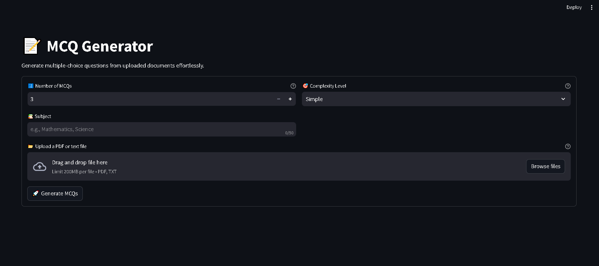
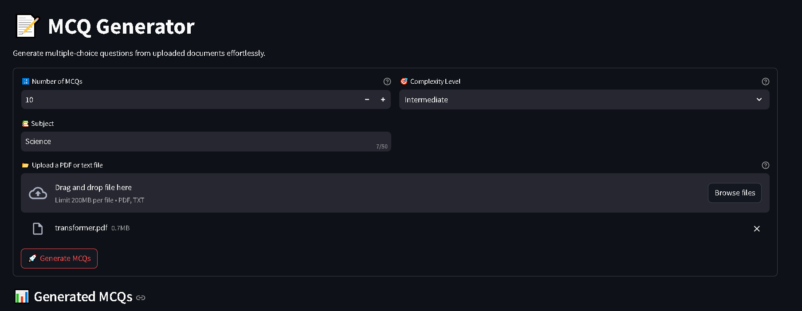
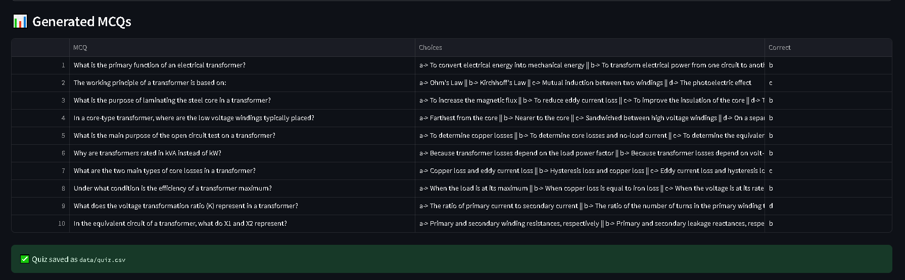

# MCQ Generator





## Overview
MCQ Generator is a Streamlit-based web application that generates multiple-choice questions (MCQs) from uploaded text or PDF documents. The application utilizes Google's Gemini API for language generation and ensures that the generated questions align with the provided content.

## Features
- Upload PDF or text files as input.
- Generate MCQs based on the uploaded content.
- Customize the number of MCQs and complexity level.
- Review generated MCQs for quality assessment.
- Save the MCQs as a CSV file for further use.

## Technologies Used
- **Python**: Core programming language.
- **Streamlit**: Web framework for UI.
- **LangChain**: Integration with LLMs (Google Gemini API).
- **Pandas**: Handling tabular data.
- **OpenAI Callback**: Token tracking and debugging.
- **Dotenv**: Environment variable management.

## Installation
### Prerequisites
Ensure you have Python 3.8+ installed on your system.

### Steps to Install
1. Clone the repository:
   ```sh
   git clone https://github.com/PriyanshuDey23/MCQ-Generator-using-Generative-Ai.git
   cd mcq-generator
   ```
2. Install required dependencies:
   ```sh
   pip install -r requirements.txt
   ```
3. Set up environment variables by creating a `.env` file:
   ```sh
   GOOGLE_API_KEY=your_google_api_key
   ```
4. Place a `Response.json` file in the root directory, which contains the expected response format.

## Usage
1. Run the application:
   ```sh
   streamlit run app.py
   ```
2. Upload a PDF or text file.
3. Select the number of MCQs and difficulty level.
4. Click **Generate MCQs** to obtain the questions.
5. Review and download the generated quiz.

## File Structure
```
mcq-generator/
│── MCQ_Generator/
│   ├── __init__.py
│   ├── mcq_generator.py            # MCQ generation logic using LangChain
│   ├── utils.py          # File reading and data processing utilities
│── app.py                # Streamlit application
│── Response.json         # JSON format for expected MCQ response
│── requirements.txt      # List of dependencies
│── .env                  # Environment variables (API keys)
```


## License
This project is licensed under the MIT License.


